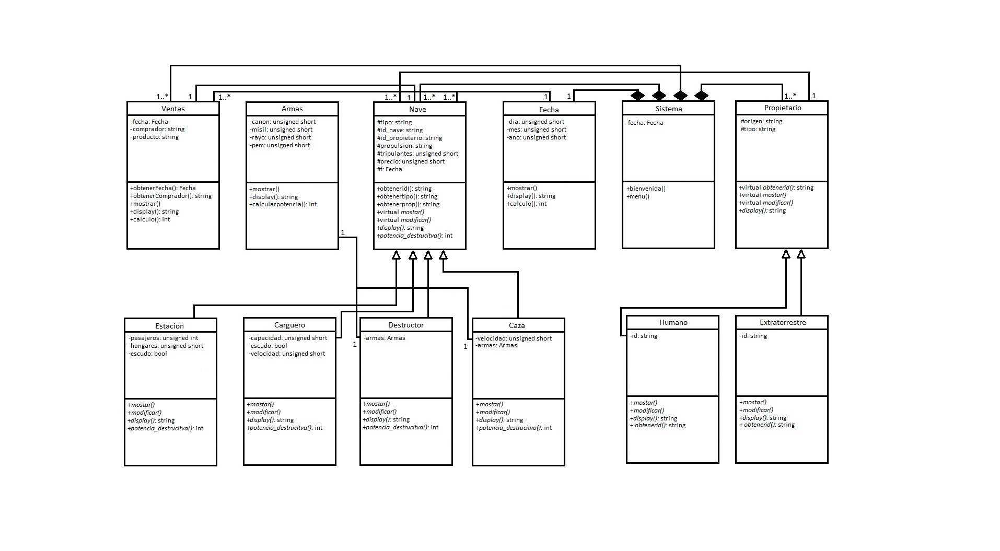

## 🛸 Concesionario de Naves Espaciales

Aplicación de consola escrita en **C++** y desarrollada en **Linux** que simula un concesionario de naves espaciales.

### Funcionalidades principales

- **Gestión de usuarios** (humanos y extraterrestres):
  - Alta, baja, edición y listado.
  - Identificación única:  
    - Humanos: 8 números y 1 letra.  
    - Extraterrestres: 9 números.
  - Registro del planeta de residencia.

- **Gestión de naves** (4 tipos):
  - Estaciones espaciales, destructores, cargueros y cazas.
  - Alta, baja, edición y listado.
  - Datos comunes: matrícula, tripulación, tipo de propulsión, precio.
  - Datos específicos según tipo de nave.

- **Compras**:
  - Los usuarios registrados pueden comprar naves disponibles.
  - Restricciones:  
    - Humanos pueden comprar destructores.  
    - Extraterrestres no pueden comprar estaciones espaciales.

- **Historial de compras**:
  - Visualización de todas las transacciones realizadas.

- **Búsqueda de ventas**:
  - Por fecha, intervalo de tiempo o ID de usuario.

📁 Todos los datos se almacenan en archivos `.txt`.

### Diagrama de clases

## Authors

* **David Villanueva Arteaga**
* **Ruben Sanchez** - [rubinsan](https://github.com/rubinsan)

## License

This project is licensed under the [MIT License](LICENSE).
